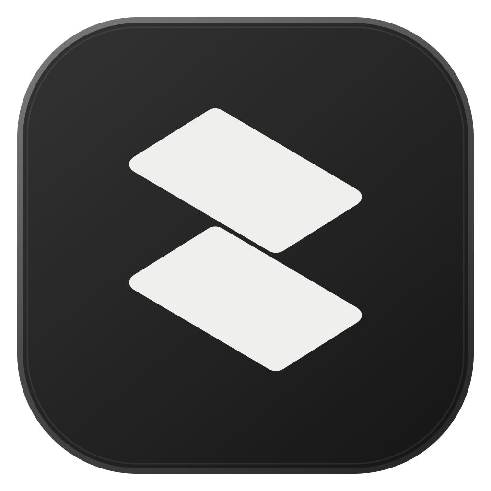

<p align="center">
  
</p>

<h1 align="center">temoto</h1>

<p align="center">
  作業の途中にあるものを、手元に残すための小さな道具。
</p>

<p align="center">
  <a href="https://temoto.haygsiiii.chatgpt.site"><strong>Webサイト</strong></a>
  ・
  <a href="https://github.com/hayashiii-ghub/temoto/releases/latest/download/temoto-macos.dmg"><strong>Mac版をダウンロード</strong></a>
  ・
  <a href="https://github.com/hayashiii-ghub/temoto/releases/latest"><strong>リリースを見る</strong></a>
</p>

<p align="center">
  <a href="https://github.com/hayashiii-ghub/temoto/releases/latest"></a>
  <a href="https://github.com/hayashiii-ghub/temoto/actions/workflows/ci.yml"></a>
  
  
</p>

## 製品

temotoは、macOSとChromeで使える3つの製品で構成されています。アカウントや分析サービスは使用せず、データと設定は各端末内で処理します。

| 製品 | 用途 | 公開状況 |
| --- | --- | --- |
| **temoto for macOS** | ファイル、フォルダ、URL、テキストを一時的に置く棚 | [v1.1.4](https://github.com/hayashiii-ghub/temoto/releases/tag/v1.1.4) |
| **temoto for Chrome** | ページを調べる6つの開発ツール | [Chrome Web Store（0.1.8）](https://chromewebstore.google.com/detail/temoto-for-chrome/gcncgknjklghkoeiapcbdghodepnllid) |
| **temoto Proxy** | Chromeのプロキシ設定をプロファイルとして管理 | [Chrome Web Store（1.0.1）](https://chromewebstore.google.com/detail/temoto-proxy/hohabmdadcdkifcmbclkgnomhhlllnbb) |

Chrome拡張はそれぞれChrome Web Storeからインストールできます。実装とプライバシー方針は、このリポジトリでも確認できます。

## temoto for macOS

ファイルやリンクを移動する前に、一時的に置いておけるフローティングシェルフです。画面上にピン留めするか、メニューバーへ収納して使います。Apple Silicon MacとIntel Macの両方に対応しています。

### 主な操作

| 操作 | 方法 |
| --- | --- |
| Finderの選択項目を棚へ追加 | `Option + Tab` |
| 棚の表示・非表示を切り替え | `Option + Shift + Tab`またはメニューバーアイコン |
| ファイルを取り出す | 棚の項目をFinderや別のアプリへドラッグ |
| 複数項目をまとめて取り出す | フッター左端のスタックをドラッグ |
| コピー・移動・ZIP化 | フッターの各アクションを選択 |
| コピーしたテキストを追加 | クリップボードアクションを明示的に実行 |
| 棚の表示場所を変更 | ピンボタンまたは`Shelf Location`メニュー |

ファイル拡張子による制限はありません。クリップボードは自動監視せず、利用者が追加操作を行った時だけテキストを取り込みます。

### インストール

1. [最新のDMGをダウンロード](https://github.com/hayashiii-ghub/temoto/releases/latest/download/temoto-macos.dmg)します。
2. `temoto.app`を`Applications`へドラッグします。
3. `Applications`から`temoto.app`を開きます。

ターミナルからインストールまたは更新する場合は、同じコマンドを使用します。

```sh
curl -fsSL https://github.com/hayashiii-ghub/temoto/releases/latest/download/install_latest.sh | bash
```

既存の`temoto.app`を検出して最新版へ入れ替えます。旧名の`ShelfDrop.app`がある場合も`temoto.app`へ移行します。

> [!NOTE]
> 現在の配布版はad hoc署名です。初回起動時にmacOSの警告が表示される場合があります。

### macOSの権限

`Option + Tab`でFinderの選択項目を取得するため、初回利用時にFinderの操作許可を求めます。ファイル、リンク、画像、テキストはドラッグ＆ドロップでも追加できます。

## temoto for Chrome

開いているページで使う6つの開発ツールを、1つのポップアップにまとめたChrome拡張です。

- 画面上の色を取得してHEX値をコピー
- 選択範囲、表示領域、ページ全体をPNGでキャプチャ
- HTML5動画の再生速度を変更し、動画上のバッジを実際の速度に同期
- Local、Staging、Production間を同じパスのまま移動
- 現在のサイトのキャッシュ、Cookie、ストレージ、Service Workerを明示操作で消去
- 要素の寸法を確認し、CSSセレクタをコピー

Video SpeedのショートカットはHTTP(S)ページ上で動作しますが、入力欄と修飾キーの組み合わせを無視し、キー入力を記録しません。ページデータを外部サーバーへ送信せず、設定はChromeの拡張ストレージへ保存します。temoto Proxyを併用すると、Chrome版のサイドパネルから有効状態を確認してProxyのマネージャーを開けます。プロファイルの切り替えや解除などの詳細操作はProxy側で行います。

[Chrome Web Storeからtemoto for Chromeをインストール](https://chromewebstore.google.com/detail/temoto-for-chrome/gcncgknjklghkoeiapcbdghodepnllid)できます。詳細は[Chrome版README](browser/temoto-chrome/README.md)と[プライバシー方針](browser/temoto-chrome/PRIVACY.md)を参照してください。

## temoto Proxy

Chromeのプロキシ設定を、名前付きの開発用プロファイルとして管理する拡張です。ブラウザ全体へ影響する`proxy`権限を分離するため、temoto for Chromeとは別の拡張として提供します。

- HTTP、HTTPS、SOCKS4、SOCKS5プロファイル
- ドメインごとのプロキシ・直接接続ルール
- 固定プロキシ、生成ルール、PAC設定
- 競合するポリシーや拡張機能の検出
- セッション内だけに保持するプロキシ認証情報
- 認証情報を含めないプロファイルのインポート・エクスポート
- temotoの設定だけを解除する安全な`Off`

閲覧履歴、ページURL、通信内容、分析データを収集しません。プロファイルは`chrome.storage.local`へ、パスワードはブラウザセッション中だけ`chrome.storage.session`へ保存します。

[Chrome Web Storeからtemoto Proxyをインストール](https://chromewebstore.google.com/detail/temoto-proxy/hohabmdadcdkifcmbclkgnomhhlllnbb)できます。詳細は[Proxy版README](browser/temoto-proxy/README.md)と[プライバシー方針](browser/temoto-proxy/PRIVACY.md)を参照してください。

## 開発

各製品は独立してビルドします。生成物と依存関係のディレクトリはGitで管理しません。

### macOS

必要な環境はmacOS 26以降、Xcode Command Line Tools、Swift 5.9以降です。

```sh
./script/build_and_run.sh
make check
make package VERSION=v1.1.4
```

### temoto for Chrome

```sh
cd browser/temoto-chrome
npm install
npm test
npm run build
npm run test:sites
```

ローカルで確認する場合は、ビルド後に`browser/temoto-chrome/dist/client`を`chrome://extensions`から読み込みます。

### temoto Proxy

```sh
cd browser/temoto-proxy
npm install
npm run check
```

ローカルで確認する場合は、ビルド後に`browser/temoto-proxy/dist/client`を`chrome://extensions`から読み込みます。

### Webサイト

```sh
cd site
npm install
npm run lint
npm test
```

## リポジトリ構成

```text
Sources/ShelfDrop/          macOSアプリ
Tests/ShelfDropTests/       macOSアプリのテスト
Assets/                     macOSアプリとブランドアセット
script/                     macOSアプリのビルド・配布スクリプト
browser/temoto-chrome/      temoto for Chrome
browser/temoto-proxy/       temoto Proxy
site/                       製品Webサイト
.github/                    CI・リリースワークフロー
```

`ShelfDrop`というディレクトリ名とシンボル名は、macOSアプリの内部名として残しています。利用者向けの製品名は`temoto`です。
